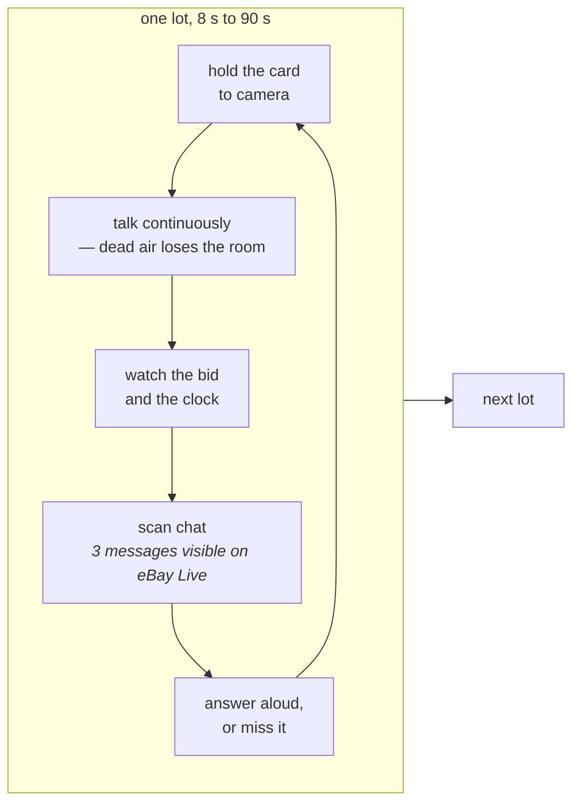
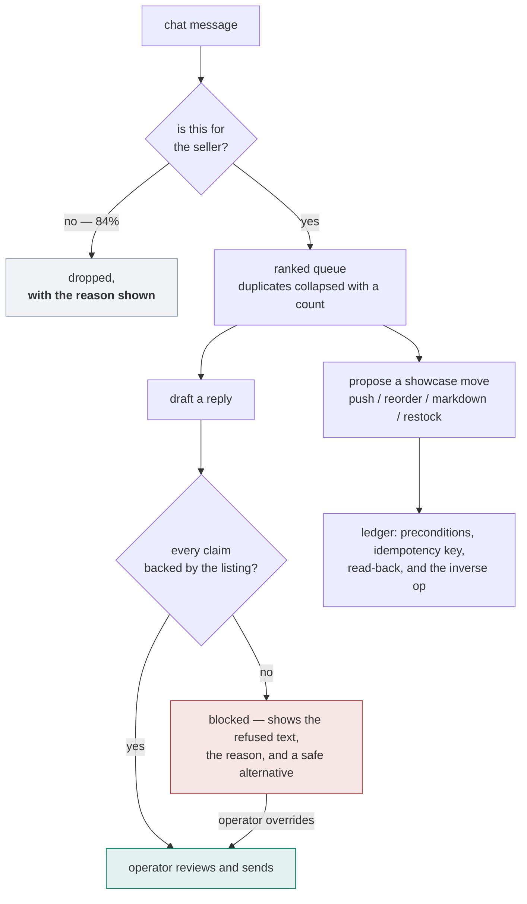
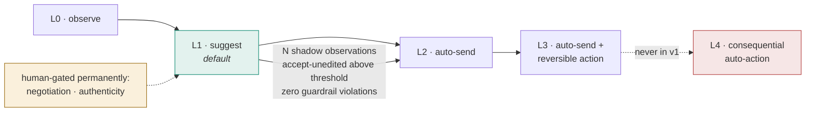

# SideStage — Product Requirements

A real-time copilot for a solo eBay Live trading-card seller. It decides which
chat messages deserve their attention, drafts replies that **cannot be sent
unless every claim checks out against the listing**, and proposes showcase moves
it knows how to undo.

> **What makes this document unusual.** Almost every claim in it comes from
> watching two real shows on two platforms and transcribing 513 chat messages
> (`docs/research/`). Where a claim is an assumption, it says so. Three
> assumptions written before any show was watched turned out to be wrong, and
> they are named in §7 rather than quietly removed.

---

## 1. The user

**A solo seller who hosts and moderates at the same time.** ~90-minute shows,
sequential lots, phone on a ring light, laptop on Seller Hub. No second pair of
hands — which is the entire reason an operator console is a product rather than
a convenience (D-01).

Both observed sellers fit this: one running graded slabs at $111–410 on Whatnot,
one running raw $1-start singles at $1–70 on eBay Live. The second has 61,289
positive feedback and has been selling since 2016. **These are working
businesses, not hobbyists**, and the constraint is attention rather than skill.

### What they are actually doing, observed



**They read chat aloud and answer in the same breath.** Captured on eBay Live,
where the platform carries live captions — a viewer typed *"why are ghost types
so heavy"* and the seller said *"Some lengths and weights are wild for
Pokemon…"* seconds later. So this is not a workflow we are introducing. It is a
workflow they are already running, badly, while holding a card.

---

## 2. The problem, in three observed facts

**① Chat is a needle in a haystack, not a firehose.** 0.15 msg/s; **16–20% of
messages are directed at the seller**. The other 84% is banter, viewers talking
to each other, and platform events. The problem is *precision at low volume*.

**② The platform's own triage is a question mark.** Whatnot highlights messages
in its UI. Across 477 messages, **every** highlighted row contains `?` and **no**
un-highlighted row does. Measured: 53.6% recall, 80.4% precision.

So roughly **half of the questions asked of a seller are never surfaced by the
tool they already have**, including the highest-intent traffic in the room:

```
lugia next!                          a queue request
320 for gare plz                     a named offer
You got any psyducks                 a catalog question
When are u selling 30th              a scheduling question
Pre bid Lugia so I can sleep         a pre-bid request, with a reason
```

**③ On eBay Live, a missed message is destroyed, not deferred.** The chat panel
shows **three messages**. A fourth arrives and the first is gone; the seller can
scroll, but not while holding a card and talking. On Whatnot you can scroll back.
Here you cannot.

> **This is the product thesis.** A queue that persists what the room asked is
> not a nicety on this surface — it is the only durable record that the question
> was ever asked.

---

## 3. What the product does



### The four things a reviewer should try

1. **Replay the real transcript.** The console pushes the actual recorded chat
   through the live system — including the 84% that is noise, not messages
   written to make it look good.
2. **Read the left column.** Every dropped message shows the features that
   dropped it (`-0.64 noise_lexicon`, `+0.50 wh_word`). A triage system the
   operator cannot audit is one they stop trusting the first time it swallows a
   buyer.
3. **Draft a reply and read the claims.** Each claim names the fact id that
   backs it. The evidence was fetched *before* the model wrote a word.
4. **Try to make it lie.** Ask about a variant the set never printed, or a comp
   with too few sales. The reply is blocked, and the block shows its reason.

### Requirements

| # | Requirement | State |
|---|---|---|
| R1 | Surface seller-directed messages and drop the rest, **explainably** | built |
| R2 | Never send a claim that is not backed by the listing or catalog | built |
| R3 | Never assert something only the seller can see (condition on a raw card) | built |
| R4 | Show the operator *why* something was blocked, and a safe alternative | built |
| R5 | The operator always decides; they may override a block | built |
| R6 | Collapse duplicate questions into one card with a count | built |
| R7 | Work with no API key, so a reviewer can run it cold | **not built** — fixtures |
| R8 | Propose showcase actions with an undo recorded at journal time | **not built** — adapter exists, ledger does not |
| R9 | Nudge the seller when a lot is hot or stalled | **not built** — D-05, gated |

---

## 4. Scope

**In.** Chat triage · grounded reply drafting with verification · showcase
actions on BIN lots · an operator console · a seeded catalogue of 15 items
(7 raw, 8 graded) across 11 sets, plus a small fashion slice.

**Out, and why.**

- **Writing to live auctions** (D-03). Bid state *feeds* replies — "will you do
  $400" is a different answer mid-auction — but the copilot never modifies a bid.
  Ending an auction early is irreversible and would be the best stress test we
  have for the ledger; it is out because it risks the core.
- **Real eBay API integration** (D-24). A mock adapter with 7 fault modes —
  including lost responses and partial writes — proves more about the write path
  in the time available than a happy-path integration would.
- **Autonomous sending, at launch.** See the ladder.
- **Voice.** The seller answers aloud already; putting a copilot in their ear is
  a different product with a different failure mode.

---

## 5. Trust is earned per class, not configured

The risk is not "the AI says something wrong". It is **misclassifying a
high-stakes question into a class that has been promoted to auto-send**.



**Promotion is earned, and the evidence is shown next to the toggle** —
*"availability_q — Auto, 98.6% accept over 212 samples"*. Ceilings differ by
class: `attribute_q` caps at L1 because variant claims are where fabrication is
most costly; `negotiation` and `authenticity_q` are human-gated permanently.

**The invariant: the ladder changes who presses send. It never changes whether
verification happens.** Nothing skips the verifier, at any tier.

---

## 6. Success metrics

**Primary — questions answered that would otherwise have been missed.** The
incumbent surfaces 53.6% of seller-directed messages. Every point above that is a
buyer who got an answer.

| metric | incumbent | now | source |
|---|---|---|---|
| recall of seller-directed messages | 45.9% | **89.2%** | 37 held-out, two platforms |
| precision of the surfaced queue | — | **93.6%** | 189 held-out, two platforms |
| unsafe replies reaching a buyer | — | **2.2%** | 89 adversarial cases |
| good replies wrongly blocked | — | **10.4%** | 77 control cases |
| cost per classified message | — | **$0.00146** | measured |

**Counter-metric, and it is the one to watch.** Over-blocking at 10.4% is the
number that decides whether an operator keeps the tool. A verifier that blocks
good replies is worthless however good its recall — which is why the control
suite is mandatory rather than optional, and why every significant verifier bug
in this project was found by it rather than by the adversarial suite.

**Not used as a metric:** accuracy (trivially gamed by dropping everything), and
cluster compression (correct behaviour, but 161 real messages contained *two*
repeats — the data does not support a headline).

---

## 7. Three assumptions the data killed

Written before any show was watched. Named here because they are the strongest
evidence that the observation was worth doing.

**"Shipping questions are the highest-volume, lowest-risk class, so they graduate
first."** `shipping_returns_q` is **0 of 513 messages**. Both platforms answer it
in a persistent banner — eBay Live shows `$5.00 Flat` on screen at all times. The
question is absent because it is **pre-empted**, not because buyers do not care.
The automation ladder's designated first rung was empty; `availability_q`
replaces it on measured volume (D-22).

**"`buy_commit` is where GMV comes from."** Also **0 of 513**. In an auction you
do not type "I'll take it" — you **bid**, and the bid goes through the platform
UI where chat never sees it. Intent to buy is expressed by an action we do not
receive as text. The purchase signal lives in `system_event` ("X won") instead
(D-13).

**"Most questions are about the lot currently on screen."** False at speed. At
8–20 s lots a viewer needs 3–5 seconds to type, by which time the lot is gone —
the observed traffic is *"is X coming up later"* and *"any more Ys"*. The
referent prior had to become a function of lot velocity rather than a constant
(D-16). At 65 s lots on eBay Live it swings back.

---

## 8. Risks

| risk | mitigation | residual |
|---|---|---|
| A fabricated attribute reaches a buyer | claims verified against evidence fetched before generation; 97.8% safe on adversarial cases | **2.2% escape rate** |
| A reply is true but misleading | claim-level verification cannot see it; an offline judge detects it | **open — the most honest limitation in the system** |
| Over-blocking makes the tool useless | mandatory control suite, reported as the headline | 10.4%, above target |
| Triage silently swallows a buyer | fails **open**: an unavailable classifier surfaces rather than drops, with a test for it | drop rate visible in the console |
| The model changes underneath us | verification checks output, not provenance; the client is a 20-line Protocol | re-measure on model change |
| Two platforms, two sellers is not a distribution | stated everywhere a number is quoted | **real — n is small** |

---

## 9. What is not built

**Replay fixtures (R7).** A reviewer with no API key can run the tests but not
the console locally. The deployed URL works. This is the highest-value remaining
item because it also unlocks the golden-replay suite.

**The action ledger (R8).** The marketplace adapter exists with its fault modes;
the ledger that wraps it — preconditions, idempotency, read-back, inverse op
recorded at journal time — does not. The console keeps a simplified journal.

**The nudge layer (R9).** Gated behind the bench, which is now done. Suite E's
labels (10 real lots with extension counts and bid deltas) are ready.

**Grounding and moment-detection suites.** Data ready for both; no runners.

---

## 10. What would falsify the thesis

Stated so it can be checked rather than argued.

- **If sellers do not read chat during a show**, the queue has no user. *Observed
  false: both sellers read messages aloud, one verbatim with a 40-second lag.*
- **If the platform's highlighting were already good**, the triage spike is
  pointless. *Measured false: 53.6% recall, and it misses the highest-intent
  traffic entirely.*
- **If over-blocking cannot be held below the noise sellers already tolerate**,
  the verifier is a worse product than no verifier. *Currently 10.4% against an
  incumbent false-positive rate near 20% — inside the bar, but this is the number
  that decides it.*
- **If verification cost sat on the critical path**, the whole design collapses
  into "call a model twice". *Measured false: 0.2 ms p95, because the evidence is
  fetched before generation rather than after.*
