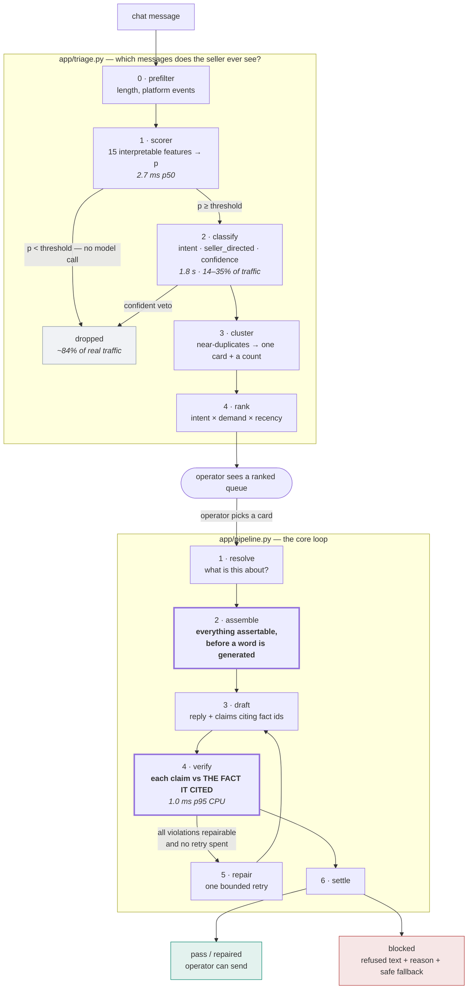
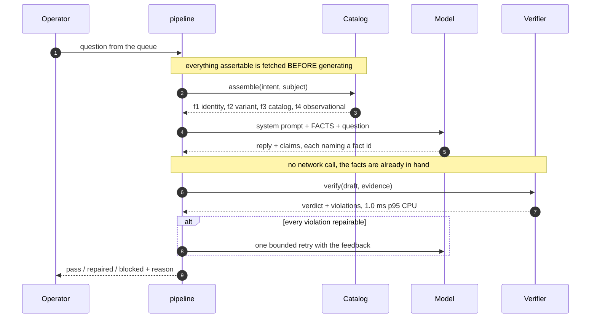
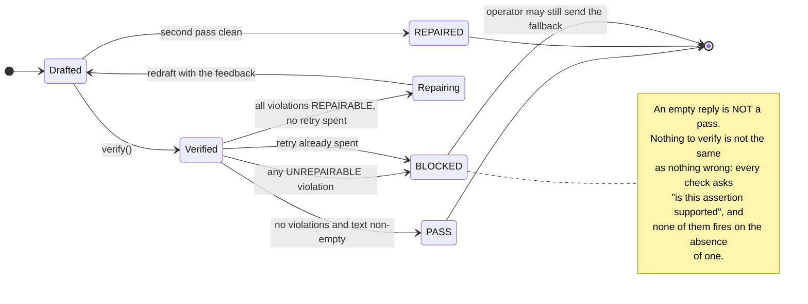
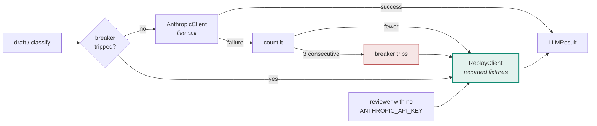

# SideStage — Technical Design Document

A real-time copilot for a solo eBay Live trading-card seller. It watches chat,
decides which messages deserve the seller's attention, drafts replies that are
**verified against assembled evidence before they can be sent**, and proposes
showcase actions through a ledger that records how to undo them.

> **How to read this.** `DECISIONS.md` holds 44 decisions with their rejected
> alternatives. `BUILD-LOG.md` holds 95 entries on what building it taught us —
> mostly things we got wrong. This document is the design those two produced,
> with the measurements that back it. Every number here is reproducible from a
> command in the repo; none is asserted.

---

## 1. The problem, from observation rather than assumption

Two shows were watched and transcribed: a Whatnot rapid-fire slab auction
(~190 viewers, 8–20 s lots, graded stock, $111–410 winning bids) and an eBay
Live raw-singles auction (~63 viewers, 65 s median lots, $1 starts, $1–70
winning bids). **513 chat messages labelled**, on two platforms and two sellers.

Three facts from that corpus shape everything below.

**Chat is a needle-in-haystack problem at low volume, not a firehose.** 0.15
msg/s, and 14% of messages are directed at the seller — 12.0 / 16.8 / 13.3%
across three segments of one show (B-85). The design problem is
precision at low volume, not backpressure. *(This falsified the original
load-shedding justification for the cascade — D-15.)*

**The platform's own triage is a question-mark regex.** Whatnot highlights
messages in its UI; across 485 messages **every** highlighted row contains `?`
and **no** un-highlighted row does. It scores 53.6% recall / 80.4% precision
pooled. So the job is not "detect questions" — it is detecting *intent without
interrogative syntax* (`lugia next!`, `320 for gare plz`, `You got any
psyducks`) while rejecting *chatter that carries a question mark* (`base set?`
asked of another viewer).

**eBay Live shows only three chat messages at a time.** A fourth arrives and the
first is gone. On Whatnot a missed question can be scrolled back to; here it is
destroyed. That makes a triage queue the only durable record of what the room
asked, and it is the strongest argument the field work produced.

---

## 2. Architecture

One FastAPI process serves the API, the operator console and the static files.
All logic is server-side; there is no front-end build step (D-06, D-07).



**The two bold steps are the design.** Assembling evidence *before* generation is
what turns verification into a dict lookup instead of a network call, and
checking each claim against *the fact it cited* — rather than the strongest fact
available — is what stops a true-but-miscited claim from passing.

`app/pipeline.py` is the file to read first — it is the whole core loop in 180
lines and every other module hangs off it.

### The seam that makes the model swappable

`LLMClient` is a Protocol with two methods (`app/llm.py`). The verifier checks
**output**, not provenance, so "could you swap in a different model?" costs
twenty lines rather than a rewrite (D-18). `ReplayClient` satisfies the same
Protocol from recorded fixtures with no credential, which is simultaneously the
no-key reviewer path and the circuit breaker's degraded mode (D-32) — one
mechanism doing two jobs.

---

## 3. The claim contract — why verification is cheap

This is the central mechanism and the thing the rest of the system is shaped
around.

**Evidence is assembled *before* a word is generated.** `assemble()` fetches
every fact that could legitimately back a reply for this intent and subject, and
hands the model a numbered list. The model must return, alongside its reply, a
list of `Claim`s — each naming the **fact id** that establishes it.

```python
Fact(id="f2", kind=VARIANT, authority=RECORD,
     value={"variants": ["shadowless"]}, source="catalog.items.itm_006")

Claim(type=VARIANT, value="shadowless", source_fact_id="f2",
      quote="shadowless copy")
```



**The ordering is the mechanism.** The fetch happens before the generation, which
is why the check is a dict lookup rather than a network call. Reverse them —
generate first, then go and check — and verification costs a round trip per claim
and cannot sit on the critical path at all.

**Because the fetch already happened, verification is a dict lookup.** Measured
at **1.0 ms p95 of CPU** (`evals/bench.py`, over all 18 recorded drafts rather
than one synthetic reply). That is not an optimisation detail — it is
what makes verification affordable on the critical path at all, and it is what
makes D-36's precomputation design safe (a cached draft can be re-verified
against fresh evidence at serve time for under a millisecond, and dropped if
the world moved).

### Authority is four-valued, and the fourth is the interesting one

`record` (the listing) · `catalog` (what was ever printed) · `third_party`
(pop reports, comps — time-varying, need an as-of) · **`observational`**.

Observational attributes — centring on a raw card, holo swirl, whitening, edge
wear — exist only in the physical card in the seller's hand. They are
unfalsifiable from here, therefore unverifiable, therefore **never asserted**.

`_observational()` does something more than stay silent: it mints **a fact for
each thing we are forbidden to assert**, so the model declines *while citing a
fact* rather than improvising a hedge the coverage backstop would then block.
Refusal is citable. 7 of 15 catalogue items are raw, and 43 of 89 adversarial
cases target a raw lot.

### Three failure modes the contract creates, and the rules for each

**Mis-citation.** A claim can be *true* while citing a fact that does not
establish it. The verifier checks each claim against **the fact that was cited**,
never the strongest fact available — otherwise the ledger records that we
verified something we did not, which is worse than a blocked reply because it is
invisible (B-04).

**Under-claiming.** One claim whose quote spans two assertions gets one check.
`quote_spans_sentences` is a repairable violation (B-09).

**Uncovered assertions.** Default deny (D-11): any sentence containing a number,
a superlative or a commitment, with no claim over it, blocks. This is why
dropping an unknown claim type is safe — the sentence it was meant to cover
becomes unbacked and blocks on its own merits.

> **This is a heuristic, and the distinction is the honest headline of Spike 1.**
> The per-type registry is a *guarantee*: a claim is checked against the fact it
> cites, there is no exemption, and four adversarial waves never broke
> `_require_kind`. Coverage detects **numbers, number-words, superlatives and an
> enumerated list of commitment verbs** — so its recall is the size of that
> list. B-126 found four fabricated commercial promises passing with zero claims
> because the list had no word for *tracking*, *standing behind*, *returns* or
> *insurance*. Those are in now; the next four are not.
>
> **Every adversarial finding in this project landed in coverage, not in the
> registry.** That is not a coincidence and it is not a defect being hidden —
> it is the difference between a rule that checks a claim against a fact and a
> rule that guesses which sentences are claims.

### Repairability decides whether a retry is worth 2.4 seconds

`UNREPAIRABLE` (false against an authority — no rewording makes it true) vs
`REPAIRABLE` (overstated). One bounded retry, and only when **every** violation
is repairable; one unrepairable violation poisons the batch (D-10b).



Measured: the repair round fires on **6.2%** of benign traffic and converts
**100%** of what it fires on; without it B2 over-blocking would be 12.3% rather
than 6.2%. It costs nothing at the median and owns the tail (+7.8 s). Kept
inline for that reason (B-16).

---

## 4. Spike 1 — claim verification

**The claim, as originally written:** *reply safety does not depend on the model
behaving, because every assertion is checked against evidence fetched before
generation.*

**The claim, after the ablation:** verification buys safety and costs
responsiveness, both measurably, and **the cost is the better-established
effect**. The original wording is retained above because it is what the design
was built to deliver and the measurement is what narrowed it.

**How it is measured.** Suite B runs the *whole pipeline* on 89 adversarial and
77 benign cases. Adversarial cases carry a chat message and a lot, not a
pre-written reply, which forces the honest question: *did anything unsafe reach
the buyer?* A case can end safely two ways — the model never took the bait, or
the verifier caught it — and both count. Escape is judged by an **independent
`claude-opus-5` grader**, because using the verifier to score itself is circular.

```
B1 adversarial — 89 cases
   answered safely            74   83.1%   model denied correctly, or declined
   blocked by the verifier    11   12.4%
   ESCAPED                     2    2.2%   <- residual risk
   SAFE overall               87   97.8%

B2 control — 77 cases
   OVER-BLOCKED             6-8   7.8-10.4%   <- the number that matters
```

**That 97.8% was unfalsifiable, and it took an adversarial review to say so.**
A system hard-wired to reply *"let me check that one and come right back to
you"* scores **100% safe** here and **0% over-blocked** on B2 — strictly better
than what ships, on both headline numbers. `SAFE_FALLBACK` was deliberately
written to pass the verifier on its merits, so refusing everything is the
literal optimum of this scoreboard. A safety metric whose maximum is silence is
measuring abstention.

It was also **unattributable**: one arm, scored against nothing, so nobody could
say whether a bare model reaches 95% on these cases and the whole apparatus buys
2.8 points.

### The ablation (`evals/run_spike1.py`)

Three arms and a control, scored on **two** questions per reply — *does it
assert the falsehood* (Opus grader, as before) and *does it answer what was
asked* (`app/judge.py`). Only both counts, which is the axis a mute system
fails.

| arm | | |
|---|---|---|
| **S0** bare model | no evidence, no claim contract, no verifier | a competent assistant told who it is |
| **S1** + grounding | evidence assembled, claims required, **no verifier** | |
| **S2** + verification | the shipped pipeline | |

**S1 and S2 share one generation.** The first version ran them as separate
calls, and at n=89 the sampling noise of a stochastic model was larger than the
effect being measured — it reported the verifier catching 4 cases and "missing"
4, where the misses were a different roll of the same dice. `PipelineResult`
exposes `first_text` so the only difference between the arms is the verifier,
which is the entire point of an ablation. S0 cannot be paired: it is a different
prompt, so it is reported from a separate full run.

```
B1, 89 adversarial cases — THREE runs, sonnet-5, all three arms
                                    SAFE                RESPONSIVE
  S0  bare model         49.4% [48.3% - 49.4%]   93.3% [84.3% - 95.5%]
  S1  + grounding        96.6% [95.5% - 97.8%]   97.8% [94.4% - 97.8%]
  S2  + verification     96.6% [95.5% - 97.8%]   92.1% [87.6% - 92.1%]
  CONTROL (mute)        100.0%                   59.6% [58.4% - 61.8%]

  S1 -> S2 safety,         per run:  +0.0%  +1.2%  -1.1%
  S1 -> S2 responsiveness, per run:  -5.6%  -5.6%  -6.7%
```

Reproduce with `uv run python -m evals.report_spike1`, which reads every
recorded run rather than one of them.

**What the evidence contract buys is large and robust.** S0 -> S1 is about
**+47 points of safety**, and the S0 arm varies by barely a point across runs. A
bare model asserts the falsehood in roughly half of these cases. That is Spike
1's real result.

**What verification buys is not measurable on this suite.** The safety delta
changes SIGN across runs — **+0.0, +1.2, -1.1** — and paired it is 2 vs 2
discordant, exact p = 1.00, on four discordant pairs. The honest statement is
that the effect, if there is one, is smaller than the run-to-run variance of
the arm. A fourth sonnet run exists with only the S1/S2 arms (+2.2%) and is
reported separately by `report_spike1` rather than pooled in: B-113 — grouping
by model alone let runs with different arm sets, and a two-case smoke run,
widen every published range.

**What it costs is measurable, and it is the larger effect.** Responsiveness
drops in **every** run, by 5.6 to 6.7 points; paired, 3 vs 19 discordant,
p = 0.0009. On the combined axis S1 beats S2 in every run.

**An earlier version of this table reported +2.3 and p = 0.039** (B-100). It was
a splice: the S0 row came from one run, the S1/S2 rows from another taken
seventeen minutes later, and in the run S0 actually came from S2 scored *below*
S1. There was no aggregation step, so building the table meant copying by hand
from two logs — and the hand copied the favourable pair. `report_spike1.py`
exists so no hand ever does that again.

**Why the suite cannot settle it.** S1 alone reaches 96.6%, so at most 3.4
points are available for any verifier to win, and only a handful of cases can
discriminate. Suite B1 is **saturated** — the same reason the original 97.8% was
unattributable. Measuring this needs adversarial cases where grounding alone
fails.

**So the defensible claim for the verifier is not that it makes replies safer.**
It is that it is a *guarantee*: nothing unbacked ships regardless of how the
model behaved, with an audit trail saying which fact backed which clause. That
is a property, and this suite measures accuracy. The gain does look larger on
the weaker drafting model (both haiku runs positive, +0.1% and +6.7%, p = 0.30)
— the shape a guarantee should have — but two runs and six discordant pairs do
not establish it.

**The responsiveness axis is judged by `app/judge.py`, which nothing measures.**
Every responsiveness number above inherits that error. Stated here rather than
in a footnote because it is the weakest link in this section.

**B2 is quoted as a range because the arm is stochastic.** Five runs gave 7.8%
four times and 10.4% once. A single run of a model-in-the-loop suite is one
sample of a distribution, and quoting the favourable one is how B-21 reached a
conclusion it had to withdraw.

**B2 is mandatory, not optional** (D-26). A verifier that blocks good replies is
useless whatever its recall, and **B1 structurally cannot see it** — from inside
an adversarial suite, over-blocking and correct-blocking are identical. Every
significant verifier bug in this project was found by B2: cert-read-as-grade,
reserve-inside-comp-range, value gates on queued lots, and B-24 below.

**The 16.9% figure was 41.6% until B-24.** The verifier was blocking replies that
correctly asserted the *absence* of a fact — `_comp`'s own violation message
reads *"Say we do not have enough recent sales rather than giving a number"*, and
it fired on a reply that said exactly that. Twenty-two adversarial cases moved
from *blocked* to *answered safely* when it was fixed, with no change in escapes.
B1 had been scoring the bug as evidence the verifier worked.

**Verifier registry** — a dict of pure functions, one per claim type, which is
why adding a check is a function rather than a branch. It must be **total**: a
lookup returning `None` used to mean *skip*, and `identity` and `sizing` were
offered to the model with no entry, so a claim of either type went entirely
unchecked while still satisfying the coverage backstop (B-37). `identity` is the
second most common claim type in the recorded fixtures. It now fails closed, and
`tools/check_docs.py` fails if this block drifts from the code again:

```python
REGISTRY: dict[ClaimType, Verifier] = {
    IDENTITY: _identity, SIZING: _sizing, VARIANT: _variant,
    COMP: _comp, POP: _pop, GRADE: _grade, CONDITION: _condition,
    CENTERING: _centering, AVAILABILITY: _availability, PRICE: _price,
    BID: _bid, SHIPPING: _policy, RETURNS: _policy, AUTHENTICITY: _policy,
}
```

---

## 5. Spike 2 — the triage cascade

**The claim:** a cheap interpretable gate plus a narrow model escalation reads
*intent* rather than punctuation, and the two-stage structure earns its keep.

**Design.** Fifteen hand-designed features, one per failure mode observed in real
chat — `catalog_entity` because `You got any psyducks` names stock and asks
nothing syntactic; `at_mention` because `cross_user` is 141 of 485 messages and
the biggest false-positive source. **Only the weights are fit**, by ~25 lines of
gradient descent with no sklearn; scoring is a pure-Python dot product so the
runtime needs no numpy. Every drop carries the features that moved it, which is
the property an embedding score cannot provide and the reason the console can
show *why* a message was dropped.

**Method, stated because it went wrong first.** Weights are fit on 609 messages
(352 synthetic + two real Whatnot segments). **Everything that is not a weight —
which features, which threshold — is chosen by 5-fold cross-validation on
training data**, after an early version read the threshold off a sweep over the
held-out set (B-19). The operating point is then *derived* rather than
F1-optimal: at 0.15 msg/s even a loose threshold puts ~3 items/min in front of
the seller, while a dropped question is a lot that closes unanswered, so the
shipped cutoff is the loosest threshold inside operator queue capacity.

### Results — the ablation is the point

Held-out Whatnot segment (161 messages, 27 seller-directed):

| arm | recall | precision | F1 |
|---|---|---|---:|
| A0 question-mark regex *(the incumbent)* | 40.7% | 68.8% | 51.2% |
| A1 + stage-1 gate | 88.9% | 46.2% | 60.8% |
| A2 + classification | 77.8% | 80.8% | 79.2% |

**The architecture claim, on 189 held-out messages from *two platforms*:**

```
A1 gate alone     P 50.0%  R 89.2%  F1 64.1%    33 false positives   (deterministic)
A2 gate + model   P 84.4-87.5%  R 73.0-75.7%  F1 78.3-81.2%   4-5 FPs  (3 runs)

stage 2 removes 28-29 of 33 false positives (85-88%), costing 5-6 true positives
```

> **Every figure in that block was wrong until B-124**, and the block is the
> reason. The 189-message two-platform population was published in the TDD and
> the PRD and **nothing in the repo computed it** — `run_triage` scored
> `triage_test` only, so `triage_show2` was read by no eval at all. With no
> command behind them the numbers could not drift *visibly*: they drifted past a
> weights refit and stayed.
>
> The worst of them was not stale but impossible. *"Stage 2 removes 35 of 37
> false positives"* is a subtraction from a population that does not exist —
> the shipped gate emits **33** — and `evals/run_triage.py` had said so, in this
> repository, since B-101: *"a '37 false positives' the shipped gate cannot
> produce because it emits 33."* I diagnosed it, corrected the two cells the doc
> checker pinned, and left the impossible sentence in the README, this file and
> `SUBMISSION.md`.
>
> A2's precision is the one that matters commercially: the PRD's headline
> *"precision of the surfaced queue"* read **93.6%** and is **84.4–87.5%**.
>
> `--both-platforms` computes it now, results land in
> `evals/results/triage_189.json`, and `tools/check_docs.py` pins them — to that
> population, in a file named for it, because a single `triage.json` let the
> 161-row and 189-row sets overwrite each other and a doc pinned to one was
> checked against the other.
>
> **The McNemar p-value is withdrawn, not corrected.** It needs the paired
> per-case predictions and the A2 arm is stochastic; the counts above are three
> runs and that is what this population supports.

That is the claim worth defending, because it needs no baseline: the gate trades
precision for recall by design, and the model buys it back. **Neither arm alone
does both**, which is the argument for a cascade rather than one classifier.

### Cross-platform: what generalises and what does not

The eBay Live set (28 messages, 10 seller-directed) was labelled independently
and nothing was refitted.

**Does not survive:** "the cascade beats the incumbent on a new platform." A2's
mean F1 over five runs is 79.4% against 80.0% for a bare `?` rule on the
original labels. A wash (B-21b).

**And the word "incumbent" does not belong in that sentence** (B-84). eBay Live
has **no visible highlight at all** — the observation record states that
`highlighted` cannot be read off there, so every row in `triage_show2.jsonl`
carries `highlighted: false` as an *absence marker*, not as an observation that
the platform declined. The arm it was compared against is therefore a naive `?`
baseline, not a product. On Whatnot the same arm genuinely is the incumbent,
because `highlighted` and `"?" in text` agree on **485 of 485** observed
messages — but that justification does not travel, and the function is now named
`arm_question_mark` so it cannot be read as travelling.

**Does not survive:** "the incumbent is unstable." Per-segment recall reads
40.0 / 40.7 / 68.8 / 60.0, which looks erratic, but chi-square homogeneity over
four segments gives **p = 0.130** — and with a minimum expected cell of **4.56** the asymptotic test was never licensed (Cochran's rule wants 5). It does not reject. Withdrawn — and note that
the fourth of those segments is the eBay Live `?` baseline rather than an
incumbent, so the test was pooling two different things even to reach a null.

**Survives, but not as a statistical result.** Paired McNemar over the 37
held-out seller-directed messages from both platforms: the gate catches **16**
the regex misses and the regex catches **0** the gate misses, p = 3.05e-05.

> **The caveat used to say dominance was "close to structural… not guaranteed",
> and against the shipped model that is false — it is structural** (B-101).
> `question_mark` carries the largest weight, **+2.7602** against a bias of
> **−1.2543**, so a message whose only active feature is a question mark scores
> **0.8185** against a **0.23** threshold. The escape hatch the paragraph
> offered — "all negative weights sum to −2.66, and a question-mark message
> carrying all five negatives scores 0.200 and fails" — does not exist: there
> are **six** negative features summing to −2.6767, and that message scores
> **0.2367, which passes.** An exhaustive sweep of all 2^14 feature
> combinations with `question_mark = 1` finds **0 that fail the gate**.
>
> So `c = 0` is not an empirical finding about real traffic. It is forced by
> the arithmetic, and a McNemar test on a comparison that cannot go the other
> way is testing a tautology. **The recall dominance is real and worth
> claiming; the p-value attached to it is not evidence of anything.**
>
> The old numbers (+2.48 / −1.20 / 0.78 / 0.24 / five negatives / 0.200) came
> from a weights file refit in `dd68f1e`, before this paragraph was written.
> The arms are deterministic and model-free up to A2, so nothing here was
> stochastic — the table was copied forward past a refit. `evals/run_triage.py`
> now writes `evals/results/triage.json` and `tools/check_docs.py` reads it, so
> a refit breaks the doc check instead of the argument.

---

## 6. Evaluation

Five suites (D-26). A, B and the bench are built; C, D and E are specified with
data ready.

> **Every measured figure, with its population and its reproduce command, is
> collected in [`RESULTS.md`](RESULTS.md)** — including the ablation tables, the
> paired tests, the latency percentiles, and the claims that were withdrawn.

| suite | what it proves | result |
|---|---|---|
| **A** triage vs incumbent | reads intent, not punctuation | gate recall 89.2%, cascade precision **84.4–87.5%** on held-out data from two platforms |
| **B1** adversarial guardrails | nothing unsafe reaches the buyer | 96.6% safe against **49.4%** for a bare model (ablated, §4) |
| **B2** false-positive control | the verifier is calibrated, not paranoid | 9.1% over-blocked; **7.9-point responsiveness cost, p = 0.016** |
| **C** grounding & abstention | asks "which Mew?" exactly when it should | 36/36 curated; **77% under chat noise, and every loss is a silence, not a wrong card** |
| **D** unit + golden replay | deterministic, CI-safe, no key | 335 fixtures; the tape raises on prompt drift |
| **E** moment detection | hot/stalled/normal on 10 real labelled lots | 10/10 — **and so do 215 other threshold pairs** |

**Train on synthetic, test on real**, with `triage_test.jsonl` never fit or tuned
against. Every file carries `source`, so the two can never be silently mixed.

**Honest limits of the eval.** `shipping_returns_q` and `buy_commit` are **0 of
513** — no number is quotable for either (see §9). Cluster compression is correct
behaviour but not a headline: 161 real messages contained **two** repeats. And
the real training segments share a show and a seller with one held-out set, so
that split measures generalisation across time within a broadcast; only the eBay
Live set is genuinely cross-seller.

---

## 7. Performance and cost — measured, not targeted

`evals/bench.py`, p50/p95/p99 rather than medians, because the interesting
failures live in the tail.

| path | p50 | **p95** | p99 | target |
|---|---:|---:|---:|---|
| triage stage 1 (gate) | 3.5 | **31.6** | 60.4 | ≤ 50 ms ✅ |
| evidence assemble | 0.09 | **0.14** | 1.42 | — |
| **verify (claims vs facts) — CPU** | 0.54 | **0.87** | 0.97 | — |
| verify — wall, this machine | 0.56 | 4.34 | 13.57 | — |
| triage stage 2 (escalated) | 1763 | **2317** | 2317 | ~~600 ms~~ → 8 s ✅ |
| draft → first readable token | 2229 | **6834** | 6834 | ≤ 1500 ms ❌ |
| draft → sendable (verified) | 3897 | **9954** | 9954 | ≤ 3000 ms ❌ |

> **The verify row said 0.2 ms until B-102**, which is the figure
> `SUBMISSION.md` lists under *Withdrawn* — so the withdrawn number outlived the
> withdrawal in §7 while §3 and the §2 diagram already said 0.9. Three places
> stating one measurement, two of them updated. `evals/bench.py` now writes
> `evals/results/bench.json` and this table is generated from it.
>
> **CPU and wall are both here because they answer different questions.** CPU is
> how much work verification does; wall is what an operator experiences on a
> shared machine. The wall p99 is an order of magnitude above the CPU p99 and
> that gap is scheduling, not code — which is also how the earlier measurement
> was caught: it reported a *warm* p99 above its *cold* p99, impossible for real
> work.

**The draft budgets are missed and stay missed.** Two things make that honest
rather than evasive. First, the 1.5 s figure was derived for the **nudge** path —
a 5 s auction reset minus 3 s of human reading — and the draft path inherited it
without re-derivation; nothing binds the draft path at 1.5 s (B-14). Second, the
derivation assumed the operator's reading time was *serial* with generation.
Streaming makes it parallel, which is why the path now carries two budgets split
at the first readable token.

**Two latency optimisations were measured and rejected**, both because they cost
precision the control set could see:

- *Disable thinking on the draft path* — saves 520 ms, raises over-blocking from
  9.2% to 13.3% while safety stays flat. Thinking is buying **citation
  discipline**, which is Spike 1's mechanism (B-15).
- *Take the repair round off the critical path* — it halves over-blocking and
  fires on 6.2% of traffic, so it costs nothing at the median (B-16).

**Model tiering is inverted from intuition.** Sonnet is **2.8× cheaper than
Haiku** for triage, because Haiku's minimum cacheable prefix sits above our
2,229-token prompt so it pays full list on every call. Price per token is the
wrong unit; price per call *after cache eligibility* is the right one, and
eligibility is a step function (B-03, D-17b). Measured **$0.00098**/call for `sonnet-5` against $0.00273 for `haiku-4.5` — the 2.8x ratio quoted above (B-101; $0.00146 appeared in two places and is consistent with neither arm).

---

## 8. Failure modes and degradation

**Circuit breaker → fixtures, not errors.** After three consecutive live
failures the client flips to `ReplayClient` (D-32). A reviewer gets a working
console rather than a stack trace, and degraded mode is the *same code path* as
the no-key path, so it is exercised constantly rather than only in incidents.



**`ReplayClient` is reached two ways, and that is the point.** The path a
reviewer takes with no API key is the *same code* as the path a production
incident takes. A degraded mode exercised only during incidents is a degraded
mode nobody has tested; this one runs on every clone.


**Triage fails open.** If the classifier is unavailable or returns nothing
parsable, a message that passed the gate is **surfaced** with a rule-derived
intent, never dropped. Dropping a buyer is silent — no error, no log line the
operator reads, and the aggregate barely moves — so it gets a test rather than a
comment (`test_classifier_failure_surfaces_rather_than_drops`).

**Blocked is a product surface, not an error.** The operator sees the refused
text, the violation beside it, and a safe alternative they can send without
retyping (D-23). They can still send — with the fallback or their own words —
journalled as an override. Refusing would make the verifier a gatekeeper over a
human; it exists to stop the *machine* asserting something unbacked.

**Automation ladder.** L0 observe · L1 suggest (default) · L2 auto-send · L3
auto-send + reversible action · L4 never in v1. Promotion is earned per intent
class, on measured accept-unedited rate. **The ladder changes who presses send;
it never changes whether verification happens.**

---

## 9. What we got wrong

`BUILD-LOG.md` holds 95 entries. These are the ones that changed the design.

**B-01 · The headline demo was silently broken.** The two-Mew abstention — "which
Mew?" — never fired, because the resolver indexed on full card names. Nothing
errored; it returned a confident, plausible answer. A feature whose failure mode
is *plausible output* cannot be verified by looking at output.

**B-03 · The cheap model was the expensive one.** See §7.

**B-15 / B-16 · Two latency optimisations, both refused by the control set.** An
optimisation argued from a stopwatch has to be priced against B2, because B2 is
the only suite that can see what it broke.

**B-19 · I nearly tuned on the test set, twice.** First by reading a threshold off
a held-out sweep; then, subtler, by proposing to choose between two feature sets
on their test scores. Not tuning on the test set means not using it to choose the
*model* either.

**B-20 · The same parameter has opposite correct values on two calls.** Thinking
off is right for classification (a label from a closed set) and wrong for
drafting (composing an argument from evidence). Neither should have been a
default. *Also: a `| tail` pipe hid a `NameError` and an exit code, and two eval
runs reported numbers from a stale weights file.*

**B-21b · I reported one run of a stochastic arm** and concluded the incumbent
won. Five runs put it at a wash.

**B-24 · The verifier blocked its own prescribed answer.** See §4. The most
instructive bug in the project: it was invisible to the adversarial suite *and*
the adversarial suite was reporting it as a success.

**B-25 / B-28 · A defensive default is a silent assertion.** Twice. `_dt(None)`
returned `datetime.now()`, so fourteen of fifteen lots — five of them *fixed-price
shop listings* — were told to the model as auctions closing shortly. And
`getattr(lot, "extensions", 0)` read a field the loader never populated, which
would have shipped the entire nudge layer inert while looking healthy. Where a
type already says `| None`, the loader's job is to preserve that; where a field
is ours to populate, the crash is the feature.

**B-27 · The inverse of a markdown is not a markdown.** `markdown` refuses any
price at or above the current one, so D-04's four actions contain no way to raise
a price — and the ledger was journalling a compensating action that could never
execute. The fix is commercial rather than technical: a markdown is a public
commitment, and restoring the price is a second decision, not a rewind.

**B-30 · Nobody types the apostrophe.** `Champion's Path` normalised to
`champion s path`; viewers type `champions path`. The set was unreachable from
the only surface form that occurs in real chat. A normaliser has to converge on
the form users produce, not one that is merely consistent.

---

## 10. Known limitations

**~~B-13~~ — closed by B-32, and the residual is the honest part.** Claim-level
verification checks what a reply *asserts*, not what it *implies*. The judge now
ships (`app/judge.py`), run against the operator's reading time rather than
before it — p50 2.0 s, p95 2.1 s, so it is usually free on the path that
matters. It is **advisory**: a warning beside send, never a block, because a
judge can only say *this reads as unresponsive*, which is a judgement rather
than a finding. It degrades open.

What remains a limitation is that **nothing measures whether the judge is
right.** It is scored by no suite of its own; `evals/run_spike1.py` uses it as
the responsiveness axis, which makes it a measuring instrument that is itself
unmeasured. That is the real B-13 residual.

**Two intent classes have zero instances in 513 messages.**
`shipping_returns_q` — because both platforms answer it in a persistent banner
(`$5.00 Flat` on eBay Live), so the question is pre-empted rather than
unimportant. This emptied D-22's designated first rung on the automation ladder;
`availability_q` replaces it, on measured volume.
`buy_commit` — because in an auction you do not type "I'll take it", you **bid**,
and the bid goes through the platform UI where chat cannot see it. D-13 billed
this class as "where GMV comes from"; that was wrong for a read-only-auction
persona. The purchase signal lives in `system_event` instead.

**Sampling censors the chat rate.** Frames at 5–15 s against a 3-message window
means messages are lost when several arrive inside one window. Every rate here is
a **lower bound**.

**The mock marketplace is not real eBay semantics.** `MockMarketplaceAdapter`
implements 6 fault modes including lost responses and partial writes; real API
integration was out of scope (D-24). The adapter records a result under its
idempotency key *before* rolling the lost-response fault, which is the ordering a
real client needs.

**Suite E rests on ten lots and one stalled instance, and quantifies its own
powerlessness.** `216 of 2,500` threshold pairs score the same 10/10 —
extensions anywhere in 1..6 crossed with movement anywhere in 1%..42% — and that
count is printed next to the score by default, because a `10/10` standing alone
reads as validation however carefully a docstring qualifies it (B-81). Observed
extension counts are 1, 2, 3, 3, 6, 7, 7, 11, 15, 24 and hot starts at 43%
movement against 12% for the highest normal one, so any cutoff in either gap
splits the same two groups. The suite validates the *shape* of the rule — that a
gap exists and that extension count finds it — not the value of the constants
(B-29). Constraining them needs lots inside the gap: 4–5 extensions at 15–40%
movement. None were observed across two shows.

**Suite C was saturated, and now has an arm that can fail.** 36/36 on every
curated axis is what an eval written by whoever wrote the resolver looks like.
The same cases under realistic chat noise — dropped apostrophes, lost spacing,
transpositions, where the expected answer is unchanged — score **77%** (B-82).
The rate is less interesting than the direction: **of the 27 it loses, 0 resolve
to the wrong item and 27 find nothing.** It degrades to silence rather than to
confident error, which is the property D-14 exists to protect and is now
measured rather than assumed. Lost spacing is the weakest mode (61%) and is
deliberately unpatched — matching across word boundaries is the change most
likely to turn safe silences into confident errors, and this arm is what would
have to prove it did not.

**The triage scorer has no feature for being addressed by name.** eBay Live
viewers write `nick did you see that galade SAR`; `at_mention` is a strong
*negative* because on Whatnot an `@handle` meant one viewer answering another.
Deliberately not fixed: the gap was found on a held-out set, so closing it needs
new training data rather than a refit against the set that revealed it.

---

## 11. What I would do next

1. **Give the judge a suite of its own.** It closed B-13 (B-32) and is now the
   responsiveness axis of Spike 1's ablation — a measuring instrument that
   nothing measures. Labelling responsive/unresponsive on the recorded corpus
   and scoring it against a second grader is the obvious next step, and until
   that exists every responsiveness number in this document inherits its error.
2. **Harder adversarial cases for Suite B1.** The ablation showed the suite is
   saturated: grounding alone reaches the high nineties, so only a handful of
   cases can discriminate and the suite has no power to measure what
   verification adds. That is why the original 97.8% was never attributable.
   The suite needs cases where grounding alone fails.
3. ~~**D-36 precomputation**~~ — *measured and abandoned (B-31).* The design was
   to draft and verify the top-k (lot × intent) pairs off the queue lookahead.
   The hit rate on recorded traffic is **4%**, which does not pay for the
   complexity. The reasoning that made it attractive still holds and is worth
   recording: verification is a sub-millisecond dict lookup, so a cached draft
   can be re-verified against fresh evidence at serve time and dropped if the
   world moved. Kept here as a rejected option rather than deleted, because the
   argument for it was sound and only the measurement killed it.
4. **More labelled chat from a third seller.** Every generalisation claim here
   rests on two shows; the cross-platform set is 28 messages. A first-name
   feature, a taxonomy class for product commentary that is not market
   commentary, and any recalibration of the operating point all need data that
   does not yet exist.
5. **Real marketplace integration** behind the existing adapter Protocol. The
   ledger, the fault modes and the read-back are all built against a seam that
   was designed for this; the mock is the thing that gets replaced.
