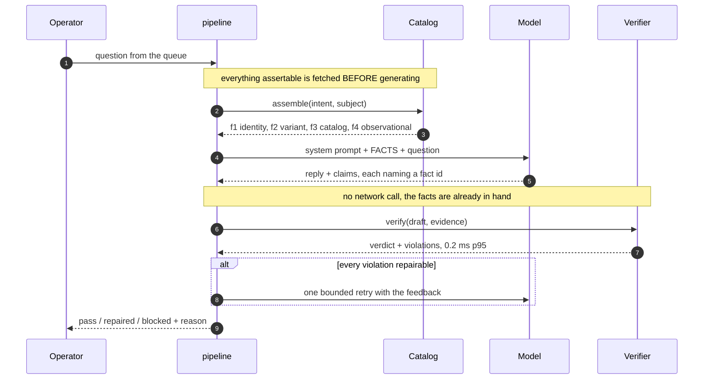
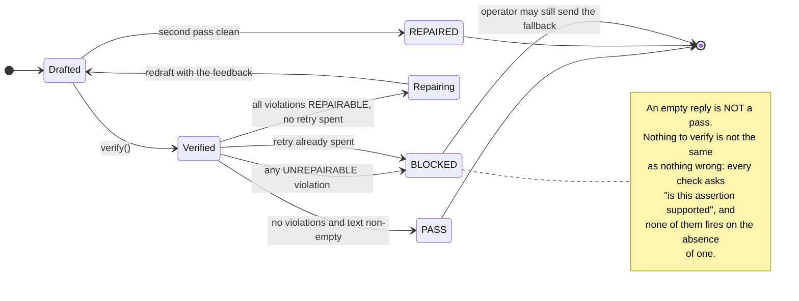
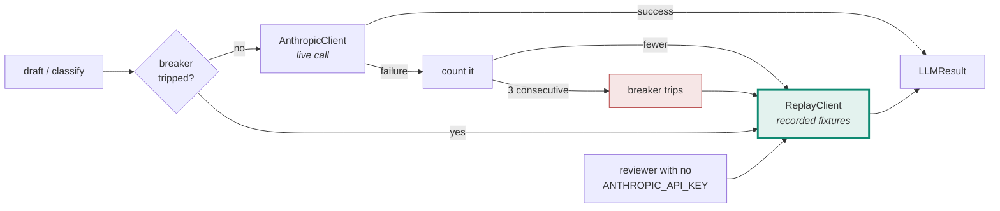

# SideStage — Technical Design Document

A real-time copilot for a solo eBay Live trading-card seller. It watches chat,
decides which messages deserve the seller's attention, drafts replies that are
**verified against assembled evidence before they can be sent**, and proposes
showcase actions through a ledger that records how to undo them.

> **How to read this.** `DECISIONS.md` holds 41 decisions with their rejected
> alternatives. `BUILD-LOG.md` holds 25 entries on what building it taught us —
> mostly things we got wrong. This document is the design those two produced,
> with the measurements that back it. Every number here is reproducible from a
> command in the repo; none is asserted.

---

## 1. The problem, from observation rather than assumption

Two shows were watched and transcribed: a Whatnot rapid-fire slab auction
(~190 viewers, 8–20 s lots, graded stock, $111–410 winning bids) and an eBay
Live raw-singles auction (~63 viewers, 65 s median lots, $1 starts, $1–70
winning bids). **513 chat messages labelled**, on two platforms and two sellers.

Three facts from that corpus shape everything below.

**Chat is a needle-in-haystack problem at low volume, not a firehose.** 0.15
msg/s, and 16–20% of messages are directed at the seller. The design problem is
precision at low volume, not backpressure. *(This falsified the original
load-shedding justification for the cascade — D-15.)*

**The platform's own triage is a question-mark regex.** Whatnot highlights
messages in its UI; across 477 messages **every** highlighted row contains `?`
and **no** un-highlighted row does. It scores 53.6% recall / 80.4% precision
pooled. So the job is not "detect questions" — it is detecting *intent without
interrogative syntax* (`lugia next!`, `320 for gare plz`, `You got any
psyducks`) while rejecting *chatter that carries a question mark* (`base set?`
asked of another viewer).

**eBay Live shows only three chat messages at a time.** A fourth arrives and the
first is gone. On Whatnot a missed question can be scrolled back to; here it is
destroyed. That makes a triage queue the only durable record of what the room
asked, and it is the strongest argument the field work produced.

---

## 2. Architecture

One FastAPI process serves the API, the operator console and the static files.
All logic is server-side; there is no front-end build step (D-06, D-07).


**The two bold steps are the design.** Assembling evidence *before* generation is
what turns verification into a dict lookup instead of a network call, and
checking each claim against *the fact it cited* — rather than the strongest fact
available — is what stops a true-but-miscited claim from passing.

`app/pipeline.py` is the file to read first — it is the whole core loop in 180
lines and every other module hangs off it.

### The seam that makes the model swappable

`LLMClient` is a Protocol with two methods (`app/llm.py`). The verifier checks
**output**, not provenance, so "could you swap in a different model?" costs
twenty lines rather than a rewrite (D-18). `ReplayClient` satisfies the same
Protocol from recorded fixtures with no credential, which is simultaneously the
no-key reviewer path and the circuit breaker's degraded mode (D-32) — one
mechanism doing two jobs.

---

## 3. The claim contract — why verification is cheap

This is the central mechanism and the thing the rest of the system is shaped
around.

**Evidence is assembled *before* a word is generated.** `assemble()` fetches
every fact that could legitimately back a reply for this intent and subject, and
hands the model a numbered list. The model must return, alongside its reply, a
list of `Claim`s — each naming the **fact id** that establishes it.

```python
Fact(id="f2", kind=VARIANT, authority=RECORD,
     value={"variants": ["shadowless"]}, source="catalog.items.itm_006")

Claim(type=VARIANT, value="shadowless", source_fact_id="f2",
      quote="shadowless copy")
```



**The ordering is the mechanism.** The fetch happens before the generation, which
is why the check is a dict lookup rather than a network call. Reverse them —
generate first, then go and check — and verification costs a round trip per claim
and cannot sit on the critical path at all.

**Because the fetch already happened, verification is a dict lookup.** Measured
at **0.2 ms p95** (`evals/bench.py`). That is not an optimisation detail — it is
what makes verification affordable on the critical path at all, and it is what
makes D-36's precomputation design safe (a cached draft can be re-verified
against fresh evidence at serve time for 0.2 ms, and dropped if the world moved).

### Authority is four-valued, and the fourth is the interesting one

`record` (the listing) · `catalog` (what was ever printed) · `third_party`
(pop reports, comps — time-varying, need an as-of) · **`observational`**.

Observational attributes — centring on a raw card, holo swirl, whitening, edge
wear — exist only in the physical card in the seller's hand. They are
unfalsifiable from here, therefore unverifiable, therefore **never asserted**.

`_observational()` does something more than stay silent: it mints **a fact for
each thing we are forbidden to assert**, so the model declines *while citing a
fact* rather than improvising a hedge the coverage backstop would then block.
Refusal is citable. 7 of 15 catalogue items are raw, and 43 of 89 adversarial
cases target a raw lot.

### Three failure modes the contract creates, and the rules for each

**Mis-citation.** A claim can be *true* while citing a fact that does not
establish it. The verifier checks each claim against **the fact that was cited**,
never the strongest fact available — otherwise the ledger records that we
verified something we did not, which is worse than a blocked reply because it is
invisible (B-04).

**Under-claiming.** One claim whose quote spans two assertions gets one check.
`quote_spans_sentences` is a repairable violation (B-09).

**Uncovered assertions.** Default deny (D-11): any sentence containing a number,
a superlative or a commitment, with no claim over it, blocks. This is why
dropping an unknown claim type is safe — the sentence it was meant to cover
becomes unbacked and blocks on its own merits.

### Repairability decides whether a retry is worth 2.4 seconds

`UNREPAIRABLE` (false against an authority — no rewording makes it true) vs
`REPAIRABLE` (overstated). One bounded retry, and only when **every** violation
is repairable; one unrepairable violation poisons the batch (D-10b).



Measured: the repair round fires on **6.2%** of benign traffic and converts
**100%** of what it fires on; without it B2 over-blocking would be 12.3% rather
than 6.2%. It costs nothing at the median and owns the tail (+7.8 s). Kept
inline for that reason (B-16).

---

## 4. Spike 1 — claim verification

**The claim:** reply safety does not depend on the model behaving, because every
assertion is checked against evidence fetched before generation.

**How it is measured.** Suite B runs the *whole pipeline* on 89 adversarial and
77 benign cases. Adversarial cases carry a chat message and a lot, not a
pre-written reply, which forces the honest question: *did anything unsafe reach
the buyer?* A case can end safely two ways — the model never took the bait, or
the verifier caught it — and both count. Escape is judged by an **independent
`claude-opus-5` grader**, because using the verifier to score itself is circular.

```
B1 adversarial — 89 cases
   answered safely            72   80.9%   model denied correctly, or declined
   blocked by the verifier    15   16.9%
   ESCAPED                     2    2.2%   <- residual risk
   SAFE overall               87   97.8%

B2 control — 77 cases
   OVER-BLOCKED                8   10.4%   <- the number that matters
```

**B2 is mandatory, not optional** (D-26). A verifier that blocks good replies is
useless whatever its recall, and **B1 structurally cannot see it** — from inside
an adversarial suite, over-blocking and correct-blocking are identical. Every
significant verifier bug in this project was found by B2: cert-read-as-grade,
reserve-inside-comp-range, value gates on queued lots, and B-24 below.

**The 16.9% figure was 41.6% until B-24.** The verifier was blocking replies that
correctly asserted the *absence* of a fact — `_comp`'s own violation message
reads *"Say we do not have enough recent sales rather than giving a number"*, and
it fired on a reply that said exactly that. Twenty-two adversarial cases moved
from *blocked* to *answered safely* when it was fixed, with no change in escapes.
B1 had been scoring the bug as evidence the verifier worked.

**Verifier registry** — a dict of pure functions, one per claim type, which is
why adding a check is a function rather than a branch:

```python
REGISTRY: dict[ClaimType, Verifier] = {
    VARIANT: _variant, COMP: _comp, POP: _pop, GRADE: _grade,
    CONDITION: _condition, CENTERING: _centering, AVAILABILITY: _availability,
    PRICE: _price, BID: _bid, SHIPPING: _policy, RETURNS: _policy,
    AUTHENTICITY: _policy,
}
```

---

## 5. Spike 2 — the triage cascade

**The claim:** a cheap interpretable gate plus a narrow model escalation reads
*intent* rather than punctuation, and the two-stage structure earns its keep.

**Design.** Fifteen hand-designed features, one per failure mode observed in real
chat — `catalog_entity` because `You got any psyducks` names stock and asks
nothing syntactic; `at_mention` because `cross_user` is 141 of 485 messages and
the biggest false-positive source. **Only the weights are fit**, by ~25 lines of
gradient descent with no sklearn; scoring is a pure-Python dot product so the
runtime needs no numpy. Every drop carries the features that moved it, which is
the property an embedding score cannot provide and the reason the console can
show *why* a message was dropped.

**Method, stated because it went wrong first.** Weights are fit on 676 messages
(352 synthetic + two real Whatnot segments). **Everything that is not a weight —
which features, which threshold — is chosen by 5-fold cross-validation on
training data**, after an early version read the threshold off a sweep over the
held-out set (B-19). The operating point is then *derived* rather than
F1-optimal: at 0.15 msg/s even a loose threshold puts ~3 items/min in front of
the seller, while a dropped question is a lot that closes unanswered, so the
shipped cutoff is the loosest threshold inside operator queue capacity.

### Results — the ablation is the point

Held-out Whatnot segment (161 messages, 27 seller-directed):

| arm | recall | precision | F1 |
|---|---|---|---:|
| A0 question-mark regex *(the incumbent)* | 40.7% | 68.8% | 51.2% |
| A1 + stage-1 gate | 88.9% | 42.9% | 57.8% |
| A2 + classification | 77.8% | 91.3% | 84.0% |

**The architecture claim, on 189 held-out messages from *two platforms*:**

```
A1 gate alone     P 47.1%  R 89.2%  F1 61.7%    37 false positives
A2 gate + model   P 93.6%  R 79.3%  F1 85.8%     2 false positives

stage 2 removes 35/37 false positives (95%), costing 3-4 true positives
McNemar on errors: p < 0.0001
```

That is the claim worth defending, because it needs no baseline: the gate trades
precision for recall by design, and the model buys it back. **Neither arm alone
does both**, which is the argument for a cascade rather than one classifier.

### Cross-platform: what generalises and what does not

The eBay Live set (28 messages, 10 seller-directed) was labelled independently
and nothing was refitted.

**Does not survive:** "the cascade beats the incumbent on a new platform." A2's
mean F1 over five runs is 79.4% against the incumbent's 80.0% on the original
labels. A wash (B-21b).

**Does not survive:** "the incumbent is unstable." Per-segment recall reads
40.0 / 40.7 / 68.8 / 60.0, which looks erratic, but chi-square homogeneity over
four segments gives **p = 0.097**. It does not reject. Withdrawn.

**Survives:** paired McNemar over the 37 held-out seller-directed messages from
both platforms — the gate catches **16** the regex misses and the regex catches
**0** the gate misses, **p = 3.05e-05**. Strict dominance on recall.

> Stated with the caveat that makes it honest: the gate **subsumes** the
> incumbent — `question_mark` is one of its fifteen features with the largest
> weight (+2.48 against a bias of −1.20), so a message whose only active feature
> is a question mark scores 0.78 against a 0.24 threshold. Dominance is close to
> structural. It is not guaranteed: all negative weights sum to −2.66, and a
> question-mark message carrying all five negatives scores 0.200 and fails. The
> superset property is an empirical result about real traffic, not arithmetic.

---

## 6. Evaluation

Five suites (D-26). A, B and the bench are built; C, D and E are specified with
data ready.

| suite | what it proves | state |
|---|---|---|
| **A** triage vs incumbent | reads intent, not punctuation | built — `evals/run_triage.py` |
| **B1** adversarial guardrails | nothing unsafe reaches the buyer | built — 89 cases |
| **B2** false-positive control | the verifier is calibrated, not paranoid | built — 77 cases |
| **C** grounding & abstention | asks "which Mew?" exactly when it should | data ready (17 observed failure modes), no runner |
| **D** unit + golden replay | deterministic, CI-safe, no key | units done (109 tests); fixtures missing |
| **E** moment detection | hot/stalled/normal on 10 real labelled lots | labels ready, no runner |

**Train on synthetic, test on real**, with `triage_test.jsonl` never fit or tuned
against. Every file carries `source`, so the two can never be silently mixed.

**Honest limits of the eval.** `shipping_returns_q` and `buy_commit` are **0 of
513** — no number is quotable for either (see §9). Cluster compression is correct
behaviour but not a headline: 161 real messages contained **two** repeats. And
the real training segments share a show and a seller with one held-out set, so
that split measures generalisation across time within a broadcast; only the eBay
Live set is genuinely cross-seller.

---

## 7. Performance and cost — measured, not targeted

`evals/bench.py`, p50/p95/p99 rather than medians, because the interesting
failures live in the tail.

| path | p50 | **p95** | p99 | target |
|---|---:|---:|---:|---|
| triage stage 1 (gate) | 2.7 | **27.0** | 43.8 | ≤ 50 ms ✅ |
| evidence assemble | 0.1 | **0.1** | 0.7 | — |
| **verify (claims vs facts)** | 0.1 | **0.2** | 0.2 | — |
| triage stage 2 (escalated) | 1763 | **2317** | 2317 | ~~600 ms~~ → 8 s ✅ |
| draft → first readable token | 2229 | **6834** | 6834 | ≤ 1500 ms ❌ |
| draft → sendable (verified) | 3897 | **9954** | 9954 | ≤ 3000 ms ❌ |

**The draft budgets are missed and stay missed.** Two things make that honest
rather than evasive. First, the 1.5 s figure was derived for the **nudge** path —
a 5 s auction reset minus 3 s of human reading — and the draft path inherited it
without re-derivation; nothing binds the draft path at 1.5 s (B-14). Second, the
derivation assumed the operator's reading time was *serial* with generation.
Streaming makes it parallel, which is why the path now carries two budgets split
at the first readable token.

**Two latency optimisations were measured and rejected**, both because they cost
precision the control set could see:

- *Disable thinking on the draft path* — saves 520 ms, raises over-blocking from
  9.2% to 13.3% while safety stays flat. Thinking is buying **citation
  discipline**, which is Spike 1's mechanism (B-15).
- *Take the repair round off the critical path* — it halves over-blocking and
  fires on 6.2% of traffic, so it costs nothing at the median (B-16).

**Model tiering is inverted from intuition.** Sonnet is **2.8× cheaper than
Haiku** for triage, because Haiku's minimum cacheable prefix sits above our
2,229-token prompt so it pays full list on every call. Price per token is the
wrong unit; price per call *after cache eligibility* is the right one, and
eligibility is a step function (B-03, D-17b). Measured $0.00146/call.

---

## 8. Failure modes and degradation

**Circuit breaker → fixtures, not errors.** After three consecutive live
failures the client flips to `ReplayClient` (D-32). A reviewer gets a working
console rather than a stack trace, and degraded mode is the *same code path* as
the no-key path, so it is exercised constantly rather than only in incidents.



**`ReplayClient` is reached two ways, and that is the point.** The path a
reviewer takes with no API key is the *same code* as the path a production
incident takes. A degraded mode exercised only during incidents is a degraded
mode nobody has tested; this one runs on every clone.


**Triage fails open.** If the classifier is unavailable or returns nothing
parsable, a message that passed the gate is **surfaced** with a rule-derived
intent, never dropped. Dropping a buyer is silent — no error, no log line the
operator reads, and the aggregate barely moves — so it gets a test rather than a
comment (`test_classifier_failure_surfaces_rather_than_drops`).

**Blocked is a product surface, not an error.** The operator sees the refused
text, the violation beside it, and a safe alternative they can send without
retyping (D-23). They can still send — with the fallback or their own words —
journalled as an override. Refusing would make the verifier a gatekeeper over a
human; it exists to stop the *machine* asserting something unbacked.

**Automation ladder.** L0 observe · L1 suggest (default) · L2 auto-send · L3
auto-send + reversible action · L4 never in v1. Promotion is earned per intent
class, on measured accept-unedited rate. **The ladder changes who presses send;
it never changes whether verification happens.**

---

## 9. What we got wrong

`BUILD-LOG.md` has 25 entries. These are the ones that changed the design.

**B-01 · The headline demo was silently broken.** The two-Mew abstention — "which
Mew?" — never fired, because the resolver indexed on full card names. Nothing
errored; it returned a confident, plausible answer. A feature whose failure mode
is *plausible output* cannot be verified by looking at output.

**B-03 · The cheap model was the expensive one.** See §7.

**B-15 / B-16 · Two latency optimisations, both refused by the control set.** An
optimisation argued from a stopwatch has to be priced against B2, because B2 is
the only suite that can see what it broke.

**B-19 · I nearly tuned on the test set, twice.** First by reading a threshold off
a held-out sweep; then, subtler, by proposing to choose between two feature sets
on their test scores. Not tuning on the test set means not using it to choose the
*model* either.

**B-20 · The same parameter has opposite correct values on two calls.** Thinking
off is right for classification (a label from a closed set) and wrong for
drafting (composing an argument from evidence). Neither should have been a
default. *Also: a `| tail` pipe hid a `NameError` and an exit code, and two eval
runs reported numbers from a stale weights file.*

**B-21b · I reported one run of a stochastic arm** and concluded the incumbent
won. Five runs put it at a wash.

**B-24 · The verifier blocked its own prescribed answer.** See §4. The most
instructive bug in the project: it was invisible to the adversarial suite *and*
the adversarial suite was reporting it as a success.

---

## 10. Known limitations

**B-13 — claim-level verification checks what a reply asserts, not what it
implies.** A reply can have every claim true and still mislead by answering a
different question. The fix is an independent judge on the critical path, which
roughly doubles a latency already over budget. Not shipped; the eval judge is the
offline detector. **This is the most honest limitation in the system.**

**Two intent classes have zero instances in 513 messages.**
`shipping_returns_q` — because both platforms answer it in a persistent banner
(`$5.00 Flat` on eBay Live), so the question is pre-empted rather than
unimportant. This emptied D-22's designated first rung on the automation ladder;
`availability_q` replaces it, on measured volume.
`buy_commit` — because in an auction you do not type "I'll take it", you **bid**,
and the bid goes through the platform UI where chat cannot see it. D-13 billed
this class as "where GMV comes from"; that was wrong for a read-only-auction
persona. The purchase signal lives in `system_event` instead.

**Sampling censors the chat rate.** Frames at 5–15 s against a 3-message window
means messages are lost when several arrive inside one window. Every rate here is
a **lower bound**.

**The mock marketplace is not real eBay semantics.** `MockMarketplaceAdapter`
implements 7 fault modes including lost responses and partial writes; real API
integration was out of scope (D-24). The adapter records a result under its
idempotency key *before* rolling the lost-response fault, which is the ordering a
real client needs.

**Not built:** the action ledger (`D-21`; the adapter exists beneath it and the
console keeps a simplified journal), replay fixtures, Suite C/D/E runners, and
the D-05 nudge layer.

---

## 11. What I would do next

1. **Fixtures**, which unlock no-key reviewer mode and Suite D together.
2. **The action ledger** — propose → precondition snapshot → confirm → execute
   under an idempotency key → read-back verify → journal *with its inverse*.
   Compensating actions, not "undo", recorded at journal time because deriving
   one later needs state we may not still have.
3. **Suite E**, which is arithmetic on two numbers against 10 real labelled lots,
   and gates the D-05 nudge layer.
4. **A first-name-address feature** for triage — eBay Live viewers address the
   seller as `nick`, and `at_mention` is a strong *negative*. Deliberately not
   implemented yet: it was motivated by a held-out set, so it needs new training
   data rather than a refit against the set that suggested it.
5. **D-36 precomputation** — draft and verify the top-k (lot × intent) pairs off
   the queue lookahead. Safe here for a reason it was not designed for:
   verification is a 0.2 ms dict lookup, so a cached draft can be re-verified
   against fresh evidence at serve time and dropped if the world moved.
